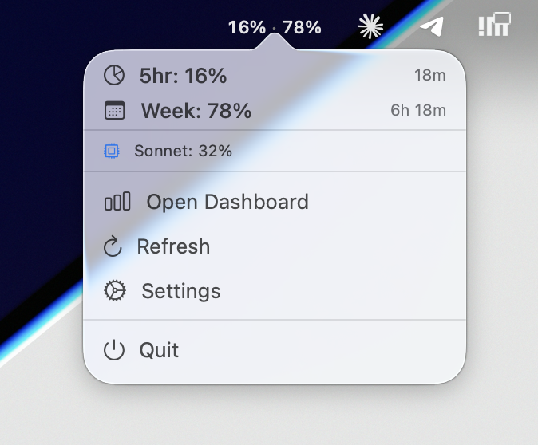
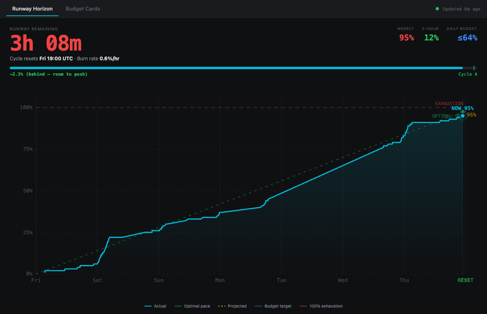
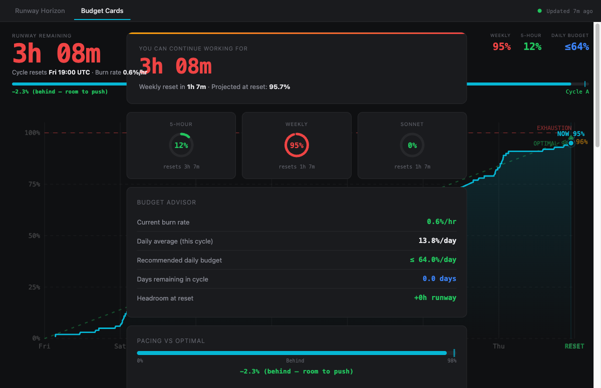

<div align="center">

# Claude Usage Systray

**Your Claude usage, always visible — right in the macOS menu bar.**

A native macOS menu bar app that shows your [Claude.ai](https://claude.ai) plan usage in real time — session limits, weekly burn, and runway projections — without opening a browser.

[](https://github.com/adntgv/claude-usage-systray/releases)
[](https://swift.org)
[](https://python.org)
[](LICENSE)

</div>

---

<div align="center">

### Menu Bar


### Popover Detail



</div>

---

### Dashboard — Runway Horizon

<div align="center">

</div>

### Dashboard — Budget Cards

<div align="center">

</div>

---

## What It Does

Mirrors the data on `claude.ai/settings/usage` — always one glance away:

| Metric | Where | Description |
|--------|-------|-------------|
| **5hr** | Menu bar + popover | Current session utilization (resets every ~5 hours) |
| **7d** | Menu bar + popover | Weekly all-models utilization |
| **Sonnet** | Popover | Weekly Sonnet-specific usage |
| **Runway** | Popover | Projected time until limit, based on burn rate |
| **Budget** | Popover | Recommended daily % to stay within the weekly cap |

Colors shift from **white → orange → red** as you approach your configured thresholds.

Click **Open Dashboard** in the popover to launch the full analytics dashboard with:
- **Runway Horizon** — weekly burn curve vs. optimal pace, projected exhaustion point, cycle grade (A–F)
- **Budget Cards** — 5hr/weekly/Sonnet gauges, burn rate, recommended daily budget, pacing vs. optimal bar

## Architecture

```
┌────────────────────────────────┐
│   SwiftUI Menu Bar App         │  ← Native macOS, reads OAuth token from Keychain
│   (status item + popover)      │
└──────────┬─────────────────────┘
           │ HTTP :17420
┌──────────▼─────────────────────┐
│   Python Analytics Engine      │  ← Polls Anthropic API, stores history in SQLite
│   (FastAPI + SQLite + stats)   │     burn rate, projections, budget math
└────────────────────────────────┘
```

The Swift app manages the UI and spawns the Python engine as a child process. The engine polls the Anthropic usage API, stores historical data points in SQLite, and computes burn-rate projections using OLS linear regression.

## Install

**Homebrew (recommended):**

```bash
brew tap adntgv/tap
brew install --cask claude-usage-systray
```

**Manual:**

Download the latest `ClaudeUsageSystray.zip` from the [Releases page](https://github.com/adntgv/claude-usage-systray/releases), unzip, and move `ClaudeUsageSystray.app` to `/Applications`.
The app is notarized — macOS will open it normally on first launch.

> **Prerequisite:** [Claude Code](https://docs.anthropic.com/en/docs/claude-code/overview) must be installed and logged in. The app reads its OAuth token from the macOS Keychain — no separate credentials needed.

## Build from Source

```bash
git clone https://github.com/adntgv/claude-usage-systray
cd claude-usage-systray/claude-usage-systray
xcodebuild -scheme ClaudeUsageSystray -configuration Release build
```

Or open in Xcode and run with **⌘R**.

The Python engine requires Python 3.11+ and installs its dependencies automatically on first launch.

## Display Modes

Toggle **Compact display** in Settings:

| Mode | Menu Bar | Description |
|------|----------|-------------|
| **Compact** (default) | `11% · 95%` | Both 5hr and 7d inline, each color-coded |
| **Normal** | `⬤ 95%` | Icon + weekly usage only |

## Settings

| Setting | Default | Description |
|---------|---------|-------------|
| Compact display | On | Show both 5hr and 7d in the menu bar |
| Warning threshold | 80% | Orange color above this level |
| Critical threshold | 90% | Red color above this level |
| Usage alerts | On | macOS notification when thresholds are crossed |

## How It Works

1. **OAuth token** — Read once from `Claude Code-credentials` in the macOS Keychain at startup
2. **API polling** — Calls the same internal endpoint that powers `claude.ai/settings/usage`:
   ```
   GET https://api.anthropic.com/api/oauth/usage
   Authorization: Bearer <oauth_token>
   ```
3. **History & projections** — The Python engine stores each data point in SQLite and computes:
   - **Burn rate** via OLS linear regression over recent samples
   - **Runway** (hours until 100% at current pace)
   - **Daily budget** (recommended max % per day to avoid hitting the cap)

> **Note:** The usage API endpoint is undocumented and may change.

## Running Tests

**Swift:**
```bash
xcodebuild test -project claude-usage-systray/ClaudeUsageSystray.xcodeproj \
  -scheme ClaudeUsageSystrayTests \
  -destination 'platform=macOS'
```

**Python engine:**
```bash
cd engine && python -m pytest tests/ -v
```

## Project Structure

```
claude-usage-systray/
├── claude-usage-systray/          # Swift macOS app
│   ├── Sources/
│   │   ├── AppDelegate.swift      # Lifecycle, engine spawning, notifications
│   │   ├── MenuBarView.swift      # Popover UI with usage + projections
│   │   ├── UsageService.swift     # API client, Keychain token reader
│   │   ├── SettingsView.swift     # Preferences window
│   │   └── ...
│   └── Tests/
├── engine/                        # Python analytics engine
│   ├── server.py                  # FastAPI server on :17420
│   ├── poller.py                  # Anthropic API poller
│   ├── db.py                      # SQLite persistence
│   ├── stats.py                   # Pure projection math (burn rate, runway)
│   ├── api.py                     # REST endpoints for the Swift app
│   └── tests/
└── assets/                        # Screenshots for this README
```

## License

MIT
